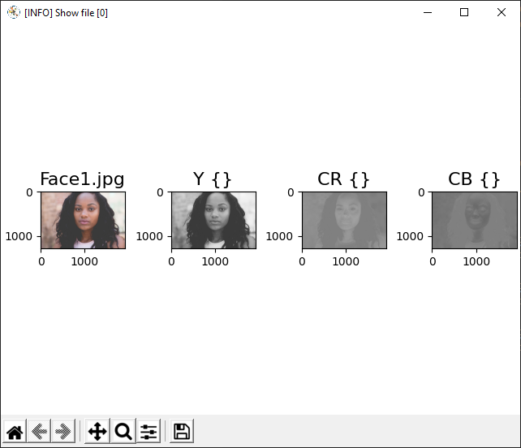

# imageViewer

Simple viewer template to experiment with image processing

This program is useful for experimenting with image processing algorithm. It takes the sample images in the Data folder and views them step by step. Navigation is done by a simple user interface with hot keys.

## Features

- Show images in a canvas



- Stores the images in the canvas in the debug folder temporarily until the next image is processed
- Object oriented. The own application class inherits from imageVier class.
- Functions to analyse time consumed by code sequences

```console
[INFO] Show file [0] F:\_Andi\_VCProjekte\imageViewer\Data\Face1.jpg 
[INFO] applying cvtColor to YCR_CB took 0.006 seconds
[INFO] total 0.006 seconds
[INFO] Show file [1] F:\_Andi\_VCProjekte\imageViewer\Data\Face11.jpg 
[INFO] applying cvtColor to YCR_CB took 0.005 seconds
[INFO] total 0.005 seconds
[INFO] Show file [2] F:\_Andi\_VCProjekte\imageViewer\Data\Face12.jpg 
[INFO] applying cvtColor to YCR_CB took 0.005 seconds
[INFO] total 0.005 seconds
```

## Hot keys

- **ESC, q, Q, x, X, c, C** will abort the program
- **Home** shows the first image
- **End** shows the last image
- **Arrow Right** shows next image
- **Arrow Left** shows previous image
- **Number + Enter** jumps to a index. The index is showed in the canvas header.

## How to use

1. Inherit your application from **imageViewer** class
2. Override  **def kernel(self)**
3. Use ```self.append()``` to add interesting intermediate result to the canvas
4. Use ```self.start_watch()``` and ```self.stop_watch()``` to analyze the time consumed by the code between

**Do not change (or with much) care the main() and loop() methods.** The risk is, that the programme hangs when showing new images.
